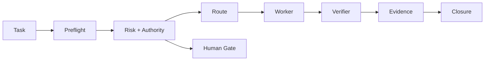

# Architecture

## Public-safe control plane



## 1. Preflight

Before execution, the system asks whether the task has:

- a clear target;
- a bounded scope;
- an identified execution surface;
- declared checks;
- a completion criterion.

Ambiguity routes to assessment rather than silent execution.

## 2. Risk and authority are separate

Two questions are intentionally independent:

1. **How risky is the change itself?**
2. **Does the executor have authority to create this effect?**

A technically simple action may still require human approval if it changes a protected external system.

## 3. Proportional autonomy

The public demo uses simplified routing states:

- `ASSESSMENT` — gather facts before implementation;
- `AUTO_ELIGIBLE` — low-risk bounded work;
- `BOUNDED_AUTONOMY` — executable work with stronger verification;
- `HUMAN_GATE` — consequential or unauthorized effect;
- `BLOCKED` — unsupported or unsafe state.

These labels are educational and do not publish the canonical Wii Ops Center thresholds.

## 4. Worker and verifier are different roles

The actor producing a change is not enough to establish correctness.

A verifier checks the declared acceptance conditions and reports failures without silently converting them to success.

## 5. Evidence-driven closure

A task is not `COMPLETED_VALIDATED` merely because code or text changed.

The public closure contract requires:

```text
declared checks pass
+ independent verifier pass
+ at least one evidence item
+ no unresolved blocker
+ human approval when required
```

## 6. Human gate does not mean bureaucracy everywhere

The purpose of a gate is to protect consequential boundaries, not to force approval for routine low-risk work.

This distinction is central to the design: increase autonomy where evidence supports it, preserve human authority where consequences justify it.
